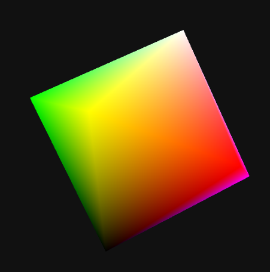

# WebGL API 

Este é um pequeno projeto de uma API que automatiza a utilização dos recursos do WebGL.

Você pode acessar alguns exemplos do projeto [aqui](https://docs/index.html).

## Exemplo de uso

Para iniciar um renderizador.

```javascript

let webgl = new WGL.Renderer( innerWidth, innerHeight );

```

Então podemos compilar programa do webgl.

```javascript

const VERTEX = `
attribute vec3 vertice;
attribute vec3 color;

uniform vec3 position;
uniform mat3 rotate;

uniform mat4 projection, view;

varying vec3 _color;

void main() {

	vec3 _vertice = (rotate * vertice) + position;

	gl_Position = projection * view * vec4( _vertice, 1.0 );
	
	_color = color;
	
}`;

const FRAGMENT = `
precision highp float;

varying vec3 _color;

void main() {

	gl_FragColor = vec4( _color, 1.0 );

}`;


let shader = webgl.createProgram( VERTEX, FRAGMENT );

webgl.setup( shader );

```

E podemos escolher o momento em que vamos utiliza-lo.

```javascript

webgl.setup( shader );

```

Então definimos os valores dos **Uniforms** e **Attributes**.
Note que não é preciso distinguir quais valores são **Uniforms** ou **Attributes**,
o renderizador irá gerenciar os valores e buffers.

```javascript


	var prisma = new Object();
		prisma.rotate = new WGL.Matrix3();
		prisma.position = new WGL.Vector3( 0, 0, -3 );

		prisma.vertice = webgl.createBuffer( new Float32Array([ ... ]) );
		prisma.color = webgl.createBuffer( new Float32Array([ ... ]));
		prisma.index = webgl.createBuffer( new Uint16Array([ ... ]) );


webgl.setAttributeList( prisma );
webgl.setUniformList( prisma );

```

Para então renderizar.

```javascript

let projection = WGL.Matrix4.Perspective( 60, innerWidth / innerHeight, .01, 1000 );

let view = new WGL.Matrix4();

webgl.setUniform( 'projection', projection );
webgl.setUniform( 'view', view );


webgl.draw( 'TRIANGLES', prisma.index );

```



